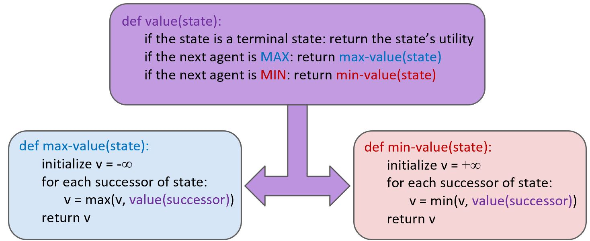
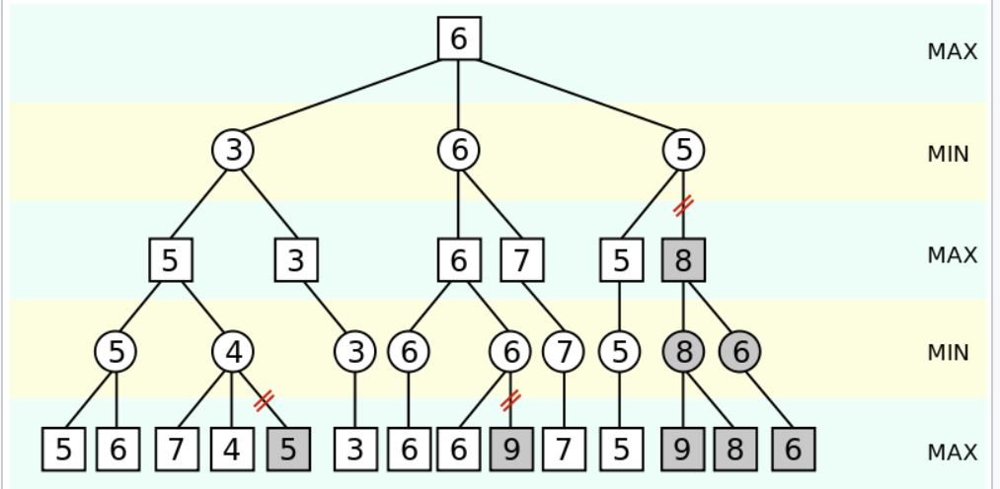
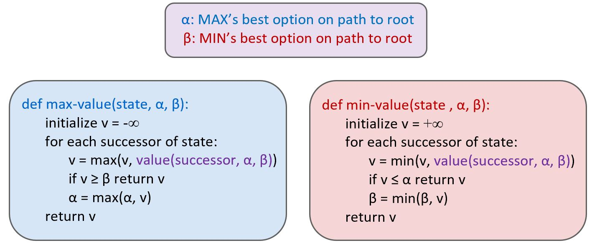
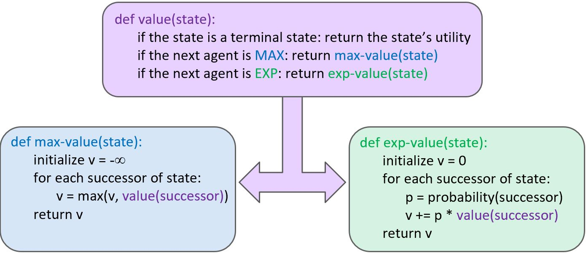

# Final Project - Pacman

For my final project I completed two of the USC Berkely Pacman AI homework projects.

## Links to Project Source Descriptions

Part 1: MultiAgent
http://ai.berkeley.edu/multiagent.html

Part 2: Tracking
http://ai.berkeley.edu/tracking.ht

### How to Run on Windows Visual Studio 2019
1. Open Visual Studio

2. Tools -> Python -> Python Environments 
        
    2.1 This will open up a side window now click "Add Environments"
        
    2.2 This will open a pop-up. Go to Python installation and install 2.7

3. If this doesn't work follow microsofts instruction guide :  https://docs.microsoft.com/en-us/visualstudio/python/installing-python-support-in-visual-studio?view=vs-2019

4. There is a Python env attached in the Project Code. Make sure it is activated.
	
    4.1. This should automatically activate but if not for to Tools -> Python -> Python Environment -> Add Environment and add the Existing Environment 

5. Choose wanted start up item:

|    start up item				| corresponding command           |  
|-------------------------------|---------------------------------|
| regular pacman				| python pacman.py                |
| multiagent autograder			| python autograder.py            |  
| multiagent reflex agent		| python pacman.py -p ReflexAgent |  
| multiagent minimax agent		| python pacman.py -p MinimaxAgent|  
| multiagent alpha-beta agent	| python pacman.py -p AlphaBetaAgent -l trappedClassic -a depth=3 -q  |  
| multiagent expecti-max agent  | python pacman.py -p ExpectimaxAgent -l trappedClassic -a depth=3 -q |  
| tracking autograder			| python autograder.py            |  

### How to Run Linux

Assigment Links have instructions for Linux. In short:

1. Open terminal at `multiagent` or `tracking`

    Autograder: `python autograder.py`

    PacMan Classic: `python pacman.py`

For specific run commands to each part refer to the assigments or the table above. This are mainly used in testing and the autograder can be run for an overall view.
Part 1 Specific Example: `python pacman.py -p ReflexAgent` 

## Discussion

Below is a description of each part, the corresponding specific test command, and the strategy used.

#### Autograder

This will run the provided autograder from UC Berkely. Their grading requirements are described in the links above. These can be run without the graphical component by using `--no-graphics`. Modify the "scriptArguments" in `launch.vs.json`.
The autograder checks for the algorithms correctness and also runs the algorithm in game. So the autograder grade is based on the algorithms tests and the average score/wins of the in game tests.

### Part 1

#### Q1 Reflex Agent

##### Description 

The task was to design a better evaluation function for pacmans next move. The stratagy for this function was to 
increase the score for moves that go towards food, decrease the score based on the ghost position (the closer the ghost the worse the deduction), and check if the ghost was in a killable state (which will increase the score).
It was useful to use the reciprical of the food distance and enemy distance because the closer they were meant the greater impact on the score.
It considered the possible actions available and calculated to score. 

This is not meant to be a perfect agent but an introduction into the project.

##### Files Edited

```
multiAgents.py:76
    - ReflexAgent:evaluationFunction()
```

#### Q2 MiniMax Agent

##### Description 

MiniMax decision making algorithms work well for zero-sum games. The algorithm assumes it is playing agaisnt an optimal player. It 
It works by assigning pacman was aiming for the maximum score and the ghosts aiming for the minimum score. This works because an increase in the pacmans score means a decrease in the ghosts score (zero-sum game).  
To keep a maximum score if the pacman knows there is no option but to die it walks into a ghost to end the game with the max points possible.

Note that this agent will not win every game (as expected) both because the ghost may not make the optimal move and because of the depth limitation.

The minimax algorithm has limitions though. One must limit the depth searched because it would not be fast enough to play through an entire possibility of game outcomes every move. Limiting the depth works but the algorithm is no longer returning the most optimal move for the full game but just of that depth search.


##### Files Edited

```
multiAgents.py:147
    - MinimaxAgent
```

#### Q3 Alpha-Beta Pruning


##### Description 

This algorithm builds on the Minimax search by removing the nodes that need to be evaluated.
Nodes are removed that are certainily a worse move than a previously examined move option. This elimates going down the tree of a move that it not usefull.



The algorithm pseudocode is:



##### Files Edited

```
multiAgents.py:217
    - MinimaxAgent
```

#### Q4 Expectimax


##### Description 
Expectimax improves on the previous algorithms as it incorporates a probabilistic model for the oponent move rather than assuming the optimal move. 
 



The change can be seen as in this varient when the pacman is trapped it still takes the chance to move towards the food hoping that the ghost makes a suboptimal move. This leads to the pacman dying with less points in this case. But overall it perfoms better as there is the case that the ghost makes a suboptimal move then the pacman is correct in taking a chance to go for more food. This can be seen in running the trapped version of the map for both alpha beta and expectimac:

```
python pacman.py -p AlphaBetaAgent -l trappedClassic -a depth=3 -q -n 10
python pacman.py -p ExpectimaxAgent -l trappedClassic -a depth=3 -q -n 10
```
AlphaBetaAgent will always lose and ExpectimaxAgent wins around 1/2 the time.

The probability is determined by the amount of move options the agent has at a given time e.i. `1/len(possibleMoves)`

##### Files Edited
```
multiAgents.py:286
    - ExpectimaxAgent
```

#### Q5 Even Better Evaluation Function

##### Description 

As opposed to the evaluation from Q1 this function considers the game state rather than actions available to score the best move. I used a linear combination of features to determine the score. The features considered
followed: 

      Food is the most important -> go to food first
        if a ghost is near us consider
            can we eat a pellet to make it killable?
                if yes -> eat pellet kill ghost
                if no -> run away (hopefully towards more food)
        if no ghost -> eat food!

Each consideration added or deducted from the score at different rates. For example food is more important the the bonus pellet that turns the ghosts white. Another example is if a ghost is near the pacman this takes priority to run away from the ghost to safety as staying alive is more important than points.

##### Files Edited
```
multiAgents.py:385
    - betterEvaluationFunction
```


#### General Discussion of Part 1

After completing this homework the difference in optimisic and pessimistic assumptions in AI. 
Assuming that the enemy makes the best move can lead to an early death or an elongated game where the pacman runs away from the ghost rather than moving towards a food item.
Constratingly, using a probablitic model can improve on the simple assumption but can still lead to deaths when chances are taking while assuming non-optimal moves for the enemy.
Overall, the expetimax algorthim would be the most fun to play agaisn't because it isn't predictable.

### Part 2

#### Q1
##### Description 
##### Files Edited
#### Q2
##### Description 
##### Files Edited
#### Q3
##### Description 
##### Files Edited
#### Q4
##### Description 
##### Files Edited
#### Q5
##### Description 
##### Files Edited
## Refrences

http://ai.berkeley.edu/lecture_slides.html
https://towardsdatascience.com/how-a-chess-playing-computer-thinks-about-its-next-move-8f028bd0e7b1
https://en.wikipedia.org/wiki/Alpha%E2%80%93beta_pruning