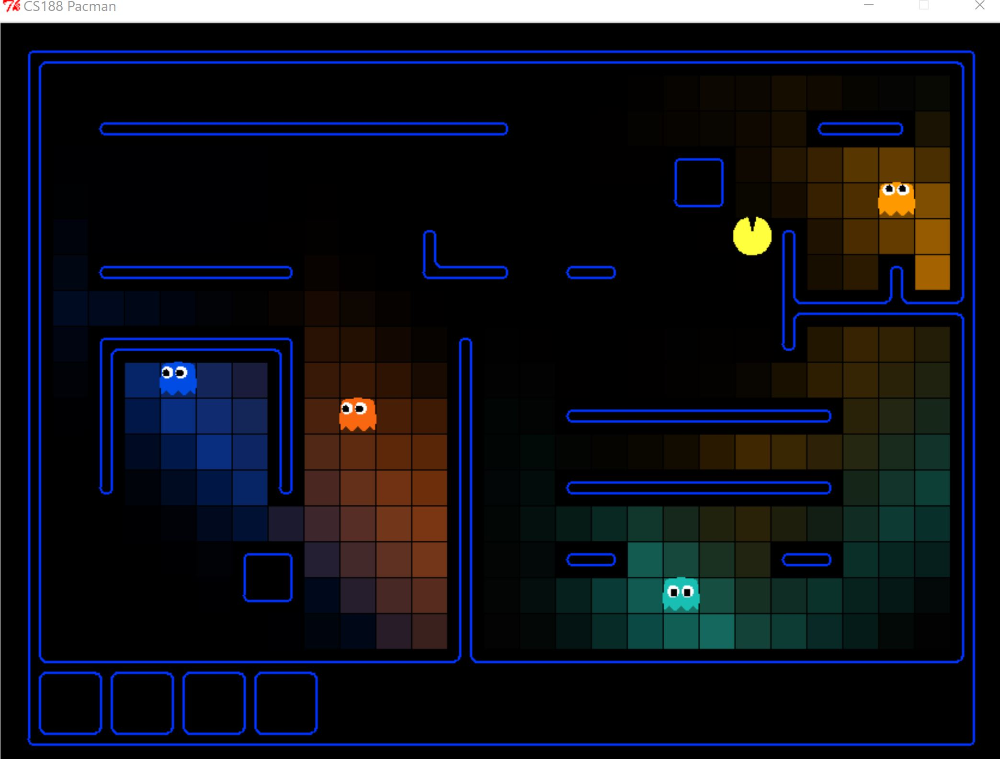
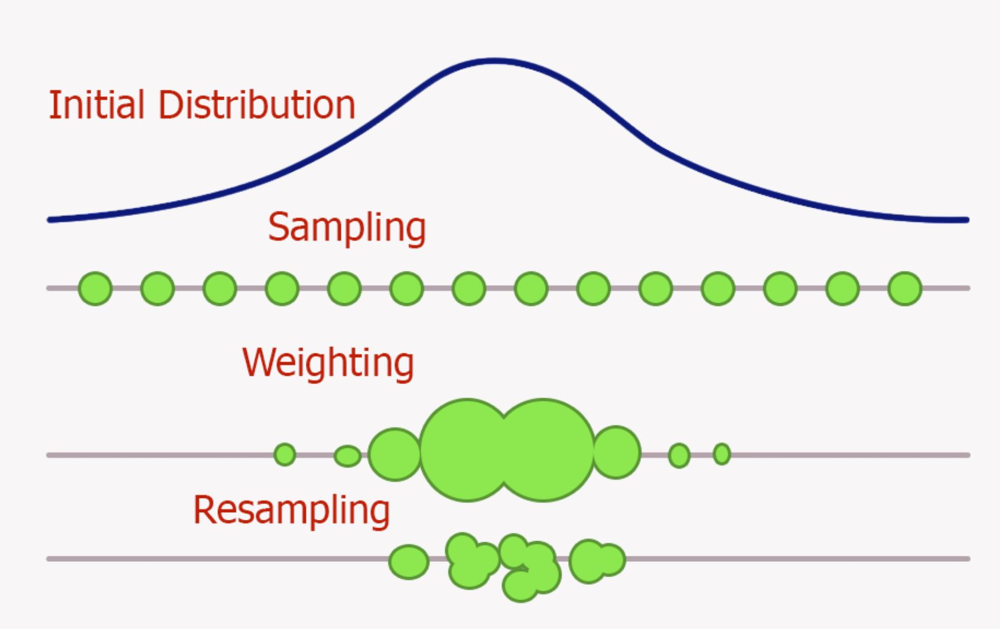

# Final Project - PacMan

For my final project, I completed the UC Berkeley PacMan AI Homework Projects 2 and 4.

## Links to Project Source Descriptions

Part 1: MultiAgent
http://ai.berkeley.edu/multiagent.html

Part 2: Ghostbuster Tracking
http://ai.berkeley.edu/tracking.ht

### How to Run on Windows Visual Studio 2019
1. Open Visual Studio

2. Tools -> Python -> Python Environments 
        
    2.1 This will open up a side window. Now click "Add Environments"
        
    2.2 This will open a pop-up. Go to Python installation and install 2.7

3. If this doesn't work, follow Microsoft's instruction guide :  https://docs.microsoft.com/en-us/visualstudio/python/installing-python-support-in-visual-studio?view=vs-2019

4. There is a Python env attached in the Project Code. Make sure it is activated.
	
    4.1. This should automatically activate, but if not, go to Tools -> Python -> Python Environment -> Add Environment and add the Existing Environment 

5. Choose desired start up item:

|    start up item				                | corresponding command                                                                             |  
|-----------------------------------------------|---------------------------------------------------------------------------------------------------|
| regular pacman				                | python pacman.py                                                                                  |
| 3. multiagent autograder			            | python autograder.py  --no-graphics                                                               |  
| 1.1 multiagent reflex agent		            | python pacman.py --frameTime 0 -p ReflexAgent -k 1                                                |  
| 1.2 multiagent minimax agent		            | python pacman.py --p MinimaxAgent -l minimaxClassic -a depth=4                                    |  
| 1.3 multiagent alpha-beta agent	            | python pacman.py -p AlphaBetaAgent -a depth=3 -l smallClassic                                     |  
| 1.4 multiagent expecti-max agent              | python pacman.py -p ExpectimaxAgent -l smallClassic -a depth=3                                    |  
| 1.5 multiagent autograder q5			        | python autograder.py  -q q5                                                                       |  
| 4. tracking autograder			            | python autograder.py   --no-graphics                                                              |  
| 2 Tracking Buster Play			            | python busters.py                                                                                 |  
| 2.1-.2 ExactInference Play			        | python busters.py  -l bigHunt -a inference=ExactInference                                         |  
| 2.1-.2 ExactInference Greedy Buster Auto		| python busters.py -l bigHunt -s -a inference=ExactInference -p GreedyBustersAgent                 |  
| 2.3 GreedyBustersAgent Auto			        | python busters.py -p GreedyBustersAgent -s -a inference=ExactInference                            |  
| 2.4-.5 ParticleFilter Play			        | python busters.py  -k 1 -a inference=ParticleFilter                                               |  
| 2.4-.5 ParticleFilter Greedy Buster Auto		| python busters.py  -k 1 -s -a inference=ParticleFilter -p GreedyBustersAgent                      |  
|2.6-.7 JointParticleFilter Play			    | python busters.py  -k 3 -a inference=MarginalInference -g DispersingGhost                         |  
|2.6-.7 JointParticleFilter Greedy Buster Auto	| python busters.py -s -k 3 -a inference=MarginalInference -g DispersingGhost -p GreedyBustersAgent |  

### How to Run Linux

Assignment links have instructions for Linux. In short:

1. Open terminal at `multiagent` or `tracking`

    Autograder: `python autograder.py`

    PacMan Classic: `python pacman.py`

For specific run commands to each part, refer to the assignments or the table above.

## Discussion

Below is a description of each part, the corresponding specific test command/startup item, and the strategy used.

#### Autograder

The autograder is provided by UC Berkeley. Their grading requirements are described in the links above. These can be run without the graphical component by using `--no-graphics`. Modify the `"scriptArguments"` in `launch.vs.json`.
The autograder checks for the algorithms correctness and also runs the algorithm in-game. The grade is based on the algorithm's correctness and the average score/wins of the in-game tests.

To run the autograde, especially the one that grades the particle filter, it is best to run on the Khoury server:

```
ssh username@login.ccs.neu.edu

git clone https://github.com/ribeiro-jenny/FinalProjectVS/settings

cd multiagent

python autograder.py

cd ../tracking

python autograder.py
```

### Part 1 Multi-Agent Search

This assignment explores different decision-making algorithms for both ghost and pacman agents.

#### Q1 Reflex Agent

##### Description 

The task was to design a better evaluation function for PacMan's next move. The strategy for this function is to 
increase the score for moves that go towards food, decrease the score based on the ghost position (the closer the ghost the worse the deduction), and check if the ghost was in a killable state (which will increase the score).
It was useful to use the reciprocal of the food distance and enemy distance because the closer they were, the greater the impact on the score. Additionally, each component had a different weight. It considered the possible actions available and calculated the corresponding score for the move. 

This is not meant to be a perfect agent but an introduction into the project.

##### Files Edited

```
multiAgents.py:76
    - ReflexAgent:evaluationFunction()
```

##### Corresponding StartUp Item
```
| 1.1 multiagent reflex agent		            | python pacman.py --frameTime 0 -p ReflexAgent -k 1                                                |  
```

#### Q2 MiniMax Agent

##### Description 

MiniMax decision-making algorithms work well for zero-sum games. The algorithm assumes it is playing against an optimal player.
It works by assigning PacMan to aim for the maximum possible score and the ghosts aiming for the minimum possible score. This works because an increase in the PacMan's score means a decrease in the ghost's score (zero-sum game). To keep a maximum score if the pacman knows there is no option but to die, it walks into a ghost to end the game with the max points possible.

Note that this agent will not win every game (as expected), both because the ghost may not make the optimal move and because of the depth limitation.

The minimax algorithm has limitions. One must limit the depth searched because it would not be fast enough to play through an entire possibility of game outcomes for every move. Limiting the depth works, but the algorithm is no longer returning the most optimal move for the full game, just of that depth search.


##### Files Edited

```
multiAgents.py:147
    - MinimaxAgent
```

##### Corresponding StartUp Item
```
| 1.2 multiagent minimax agent		            | python pacman.py --p MinimaxAgent -l minimaxClassic -a depth=4                                    |  
```

#### Q3 Alpha-Beta Pruning

##### Description 

This algorithm builds on the MiniMax search by removing the nodes that are determined tobe a worse move than a previously examined move option - meaning those moves will result in a lower score. This elimates going down the tree of a move that is not useful in maximizing the score.


The algorithm pseudocode is:


##### Files Edited

```
multiAgents.py:217
    - AlphaBetaAgent
```

##### Corresponding StartUp Item
```
| 1.3 multiagent alpha-beta agent	            | python pacman.py -p AlphaBetaAgent -a depth=3 -l smallClassic                                     |  
```

#### Q4 Expectimax

##### Description 

Expectimax improves on the previous algorithms as it incorporates a probabilistic model for the oponent move rather than assuming the optimal move. The probability is determined by the amount of move options the agent has at a given time e.i. `1/len(possibleMoves)`. Different methods can be used to calculate the probability, such as using an evaluation function for score, random probability, or uniform distribution.
 


The change can be seen as in this variant of the algorithm when PacMan is trapped, it still moves towards the food hoping that the ghost makes a suboptimal move. This leads to PacMan dying with fewer points in this case. Overall, it performs better as there is the case that the ghost makes a suboptimal move, making PacMan correct in taking a chance to go for more food. This can be seen in running the trapped version of the map for both alpha beta and expectimax:

```
python pacman.py -p AlphaBetaAgent -l trappedClassic -a depth=3 -q -n 10

python pacman.py -p ExpectimaxAgent -l trappedClassic -a depth=3 -q -n 10
```

AlphaBetaAgent will always lose and ExpectiMaxAgent wins around 1/2 the time.

##### Files Edited

```
multiAgents.py:286
    - ExpectimaxAgent
```

##### Corresponding StartUp Item
```
| 1.4 multiagent expecti-max agent              | python pacman.py -p ExpectimaxAgent -l smallClassic -a depth=3                                    |  
```

#### Q5 Even Better Evaluation Function

##### Description 

As opposed to the evaluation from Q1, this function considers the game state rather than the actions available to score the best move. I used a linear combination of features to determine the score. The features considered are: 

      Food is the most important -> go to food first
        if a ghost is near us consider
            can we eat a pellet to make it killable?
                if yes -> eat pellet kill ghost
                if no -> run away (hopefully towards more food)
        if no ghost -> eat food!

Each consideration adds or deducts from the score at different rates. For example, food is more important the the bonus pellet that turns the ghosts white. Another example is if a ghost is near PacMan, running away from the ghost takes priority to safety as staying alive is more important than points.

##### Files Edited

```
multiAgents.py:385
    - betterEvaluationFunction()
```

##### Corresponding StartUp Item
```
| 1.5 multiagent autograder q5			        | python autograder.py  -q q5                                                                       |  
```

#### General Discussion of Part 1

After completing this homework the difference in optimisic and pessimistic assumptions in AI was made more apparent. 
Assuming that the enemy makes the best move can lead to an early death or an elongated game where the pacman runs away from the ghost rather than moving towards a food item. Contrastingly, using a probablitic model can improve on the simple assumption but can still lead to deaths when chances are taking while assuming non-optimal moves for the enemy. Overall, the ExpectiMax algorthim would be the most fun to play agaisn't because it isn't predictable.

### Part 2 GhostBusters

In this version of PacMan, he sadly cannot see the ghosts but he can hear them! The following explores different algorithms for locating the ghosts.
PacMan hears via noisy readings of the manhattan distance to the ghost.

For these implementations, each has a playable version and an auto play version by a greedy pacman. In the auto play, the ghosts have been displayed (`-s`) so that the process can be easily visualized. In the playable version, no ghosts are shown to be true to PacMan's perspective.

Play `2 Tracking Buster Player` for a crude tracking algorithm. This can be compared to the improvements made below for tracking.

Note: The brighter the tile, the more certain PacMan is that there is a ghost located there.
 
#### Q1 - Q2 Exact Interface

##### Description 

Here the update of PacMan's belief distribution based on the sensor information that was implemented. The distribution starts out uniform and is updated to the information gathered at each turn. When a ghost is captured, its distribution is removed.

Q2 builds on this initial implementation and includes filtering the noisy data. Because PacMan tracks time, it can filter out data that says PacMan went from 2 squares away to 10 because a ghost can only move one square per turn.

The progression of the distribution can be seen:




##### Files Edited

```
interface.py:111
    - ExactInference::observe()
    - ExactInference::elapseTime()
```

##### Corresponding StartUp Item
```
| 2.1-.2 ExactInference Play			        | python busters.py  -l bigHunt -a inference=ExactInference                                         |  
| 2.1-.2 ExactInference Greedy Buster Auto		| python busters.py -l bigHunt -s -a inference=ExactInference -p GreedyBustersAgent                 |  
```

#### Q3 Greedy Agent

##### Description 

The greedy PacMan agent assumes that the ghost is located in the most likely square based on its observations. It will move towards the likeliest closest ghost (so, the closest square with the highest probability).

##### Files Edited

```
bustersAgents.py:125
    - GreedyBustersAgent::chooseAction()
```

##### Corresponding StartUp Item
```
| 2.3 GreedyBustersAgent Auto			        | python busters.py -p GreedyBustersAgent -s -a inference=ExactInference                            |  
```

#### Q4 - Q5 Particle Filter

##### Description 

Q4 - Q5 focused on implementing a particle filtering algorithm to locate the ghost. The algorithm follows this flow (as shown in the picture below): initial distribution -> sampling -> weighting -> resampling. This repeats on every turn.

Particles are used to mirror the probability distribution as shown:


Q5 extends this algorithm by filtering out noisy data as explained in Q1. Although it filters out noisy data, there is still noise as seen below. This is because this is a probabilitic model, versus using the exact position information in Q1/2. 


##### Files Edited

```
interface.py:241
    - ParticleFilter::observe()
    - ParticleFilter::elapseTime()
    - ParticleFilter::initializeUniformly()
    - ParticleFilter::getBeliefDistribution()
```

##### Corresponding StartUp Item
```
| 2.4-.5 ParticleFilter Play			        | python busters.py  -k 1 -a inference=ParticleFilter                                               |  
| 2.4-.5 ParticleFilter Greedy Buster Auto		| python busters.py  -k 1 -s -a inference=ParticleFilter -p GreedyBustersAgent                      |  
```

#### Q6 - Q7 Joint Particle Filter

##### Description 

This algorithm improves on the Q4-Q5 by now considering multiple ghosts simultaneously, versus tracking each one independently. This is done using a dynamic Bayes net and particles. Each particle is now a tuple of ghost positions rather than just a single position. The algorithm follows the same structure above: initial distribution -> sampling -> weighting -> resampling.

Q7 extends this algorithm by filtering out noisy data as explained in Q1.

The Progression can be seen:


Tracking ghosts simultaneously is more accurate as more data is being taken into consideration. Knowing that the ghosts will move onto each other helps distinguish the probability of their next move.

##### Files Edited

```
interface.py:410
    - JointParticleFilter::observeState()
    - JointParticleFilter::elapseTime()
    - JointParticleFilter::initializeParticles()
    - JointParticleFilter::getBeliefDistribution()
    - JointParticleFilter::jailGhosts()
```

##### Corresponding StartUp Item
```
|2.6-.7 JointParticleFilter Play			    | python busters.py  -k 3 -a inference=MarginalInference -g DispersingGhost                         |  
|2.6-.7 JointParticleFilter Greedy Buster Auto	| python busters.py -s -k 3 -a inference=MarginalInference -g DispersingGhost -p GreedyBustersAgent |  
```

#### General Discussion of Part 2

The most difficult part of this section was the particle filtering. Originally, I mistakenly tripled the particle count, causing the algorithm to run incredibly slowly. Particle filtering is an expensive computation that can be sped up with parallezation. It would be interesting to extend this assignment by paralizing the filtering to see what the speed up would be.

Although it was interesting to explore particle filters, I do not think it would be useful for Game AI. It is most useful in uncontrolled volitale enviorments. Since you can give agents all information needed in a game, this algorithm would be overkill. It is computationally expensive and wouldn't improve the gameplay by using it.

## Refrences

http://ai.berkeley.edu/lecture_slides.html

https://towardsdatascience.com/how-a-chess-playing-computer-thinks-about-its-next-move-8f028bd0e7b1

https://en.wikipedia.org/wiki/Alpha%E2%80%93beta_pruning

https://courses.cs.washington.edu/courses/cse473/12au/pacman/tracking/busters.html

https://towardsdatascience.com/optimal-estimation-algorithms-kalman-and-particle-filters-be62dcb5e83

https://towardsdatascience.com/particle-filter-a-hero-in-the-world-of-non-linearity-and-non-gaussian-6d8947f4a3dc
